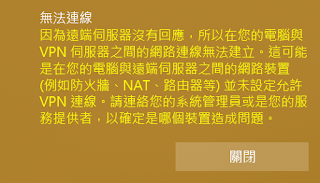
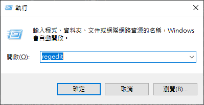
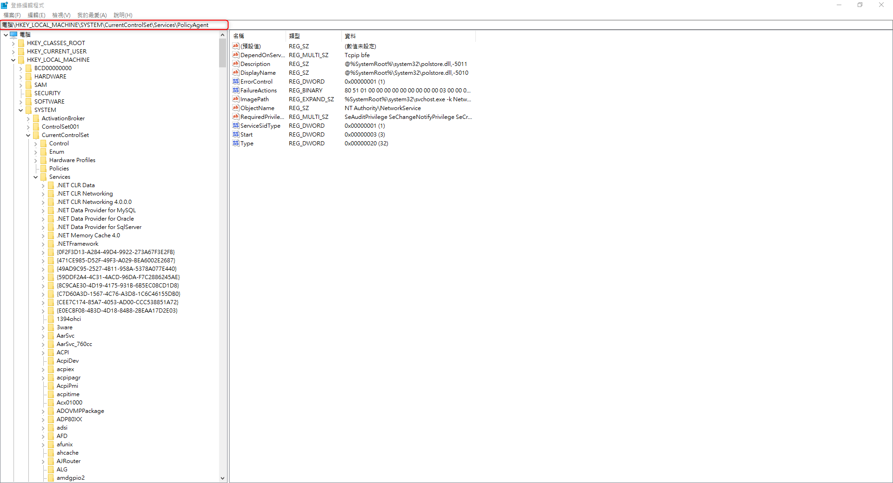

# Windows - win10 無法建立VPN連線

***
***

**連 `VPN` 時出現以下錯誤訊息**
=====

***
***

   

***
***

**解決方法**
=====

***
***

**1. `Win + R` 輸入 `regedit`**
-----

***
***

   

***
***
    
**2.尋找此路徑 `HKEYLOCALMACHINE\SYSTEM\CurrentControlSet\Services\PolicyAgent`**
-----

***
***

   

***
***
    
**3.新增一組機碼** 
-----
    
**類型:`DWORD (32-bit)`** 
    
**名稱:AssumeUDPEncapsulationContextOnSendRule**

***
***
    
**4.並且將值設定為`2`**
-----

***
***
    
**5.重開機**
-----

***
***

***





---

> Author: Laurance  
> URL: https://laurance.eu.org/posts/windows-windows-10-%E7%84%A1%E6%B3%95%E5%BB%BA%E7%AB%8Bvpn%E9%80%A3%E7%B7%9A/  

