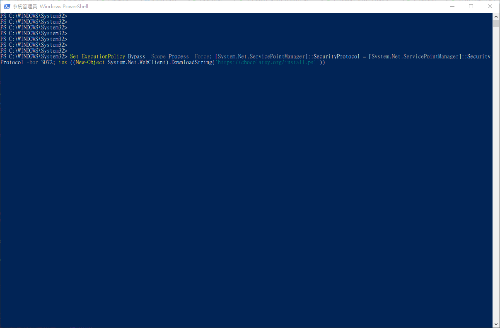
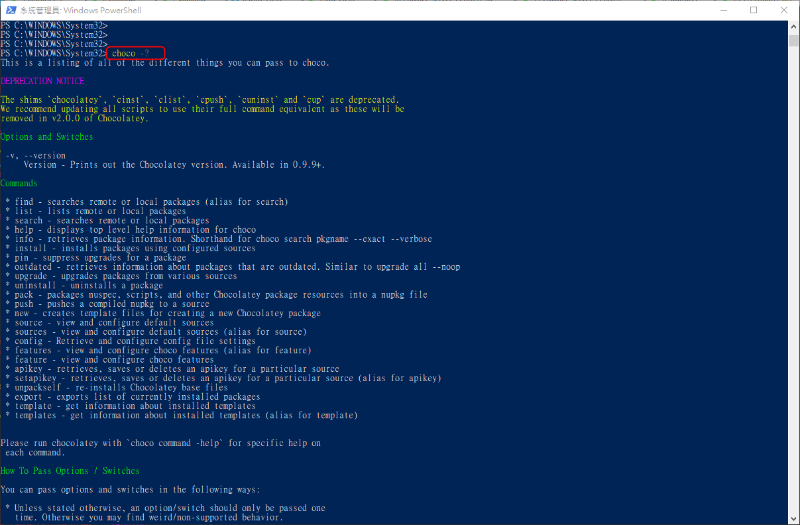
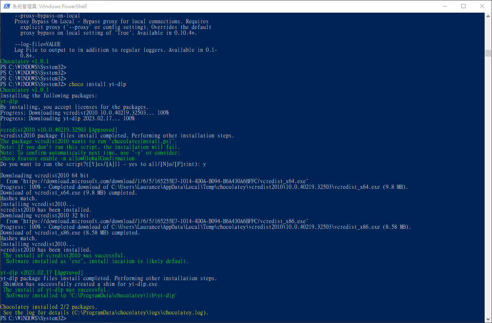

# Windows - 安裝影片下載工具 yt-dlp 及 Chocolatey


***
***

**環境: Win10 , Powershell 版本: 5.1.19041.1682**
=====

***
***

**安裝 Chocolatey**
-----

***
***

**使用 `Powershell` 查看 `PSVersion` 版本**

```sql
psversiontable
```
    
```sql
Name                           Value
----                           -----
PSVersion                      5.1.19041.1682
PSEdition                      Desktop
PSCompatibleVersions           {1.0, 2.0, 3.0, 4.0...}
BuildVersion                   10.0.19041.1682
CLRVersion                     4.0.30319.42000
WSManStackVersion              3.0
PSRemotingProtocolVersion      2.3
SerializationVersion           1.1.0.1
```

***
***

**在 `powershell` 中輸入以下指令下載 `Chocolatey`**

```sql
Set-ExecutionPolicy Bypass -Scope Process -Force; [System.Net.ServicePointManager]::SecurityProtocol = [System.Net.ServicePointManager]::SecurityProtocol -bor 3072; iex ((New-Object System.Net.WebClient).DownloadString('https://chocolatey.org/install.ps1'))
```

***
***
    


***
***

**下載完成可用指令查看 `help`**

```sql
choco -?
```

***
***



***
***

**使用 `choco` 下載 `yt-dlp`**
-----

```sql
choco install yt-dlp
```

***
***
    


***
***


***


<style>
.emojify {
	font-family: Apple Color Emoji, Segoe UI Emoji, NotoColorEmoji, Segoe UI Symbol, Android Emoji, EmojiSymbols;
	font-size: 2rem;
	vertical-align: left;
}
@media screen and (max-width:650px) {
  .nowrap {
    display: block;
    margin: 25px 0;
  }
}
</style>



---

> Author: Laurance  
> URL: https://laurance.eu.org/posts/windows-%E5%AE%89%E8%A3%9D%E7%A8%8B%E5%BC%8F--chocolatey/  

