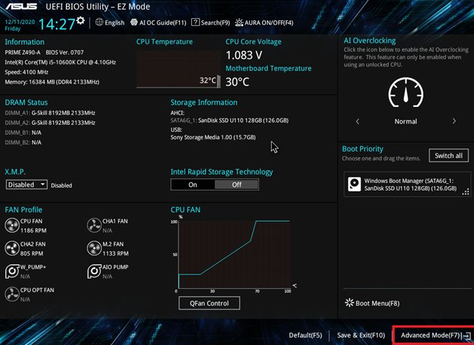
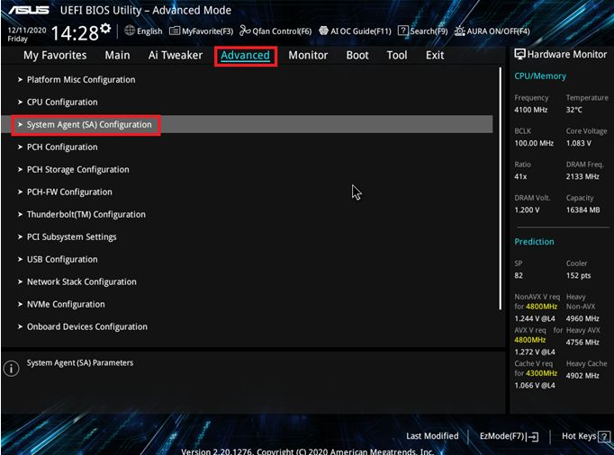
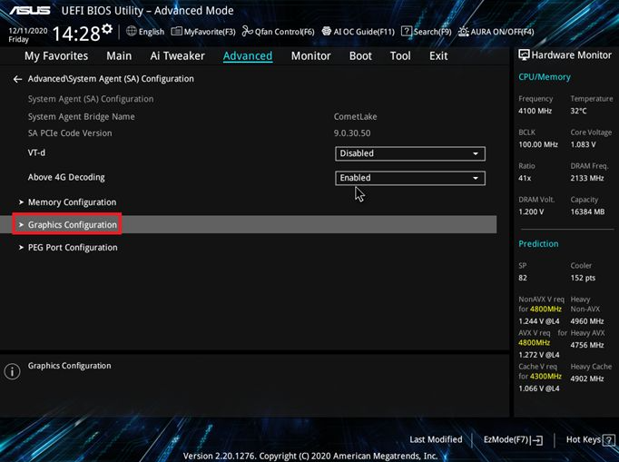
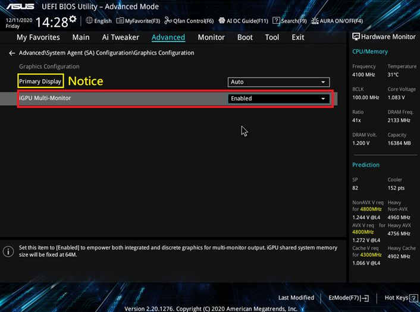

# Windows - 設定 BIOS 透過內顯與獨顯做多螢幕輸出

***
***

**進入`BIOS`**

***

**按`F7`進入進階模式**

***
***
    

***
***
    
**點選`Advanced` 頁面，進入`System Agent (SA) Configuration`**

***
***

***
***
    
**在`System Agent (SA) Configuration`底下點選`Graphics Configuration`**

***
***
    

***
***

**進入`Graphics Configuration`項目後，把`iGPU Multi-Monitor`選項設定為`Enable`**

***
***



**`Primary Display`可以設定螢幕顯示方式**  

***
    
**1. 為自動偵測 `Auto`** 

***
 
**2. 獨立顯示卡 `PCIE` 輸出**  

***

**3. 內建顯示 `iGPU` 輸出**



***
***
    

***
***

**按 `F10` 儲存後重新開機**

***

**`WIN+X+M` 進入裝置管理員**

***
    
**在裝置管理員，可以看到 `內建顯示晶片` 和 `外接獨立顯示卡` 兩個顯示卡輸出裝置**    

***





---

> Author: Laurance  
> URL: https://laurance.eu.org/posts/windows-%E9%80%8F%E9%81%8E%E5%85%A7%E9%A1%AF%E8%88%87%E7%8D%A8%E9%A1%AF%E5%81%9A%E5%A4%9A%E8%9E%A2%E5%B9%95%E8%BC%B8%E5%87%BA/  

