# XenServer - 安装教學

<!--more-->
Citrix XenServer 7.2 虛擬化集群搭建

***
***

**Xenserver 安裝步驟**
======

***
***

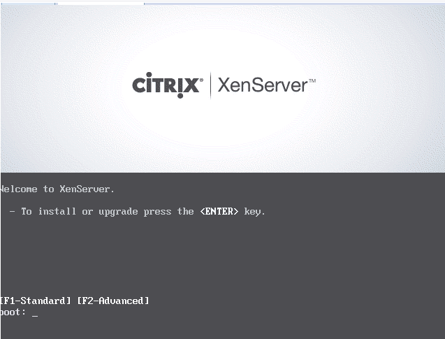

***

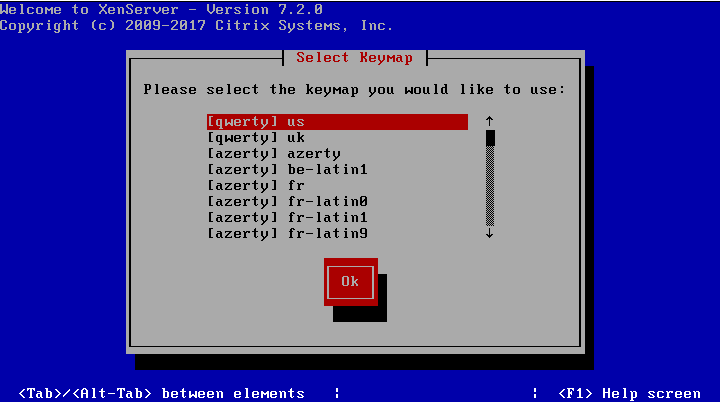

***

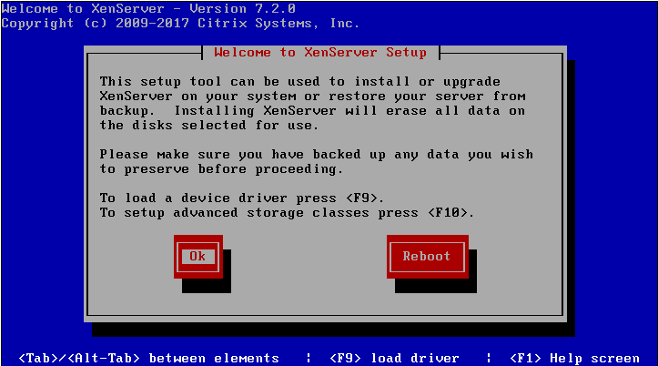

***

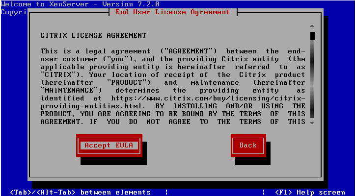

***

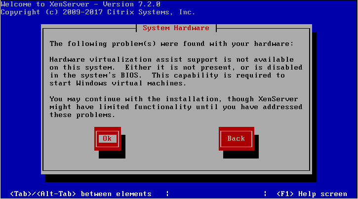

***

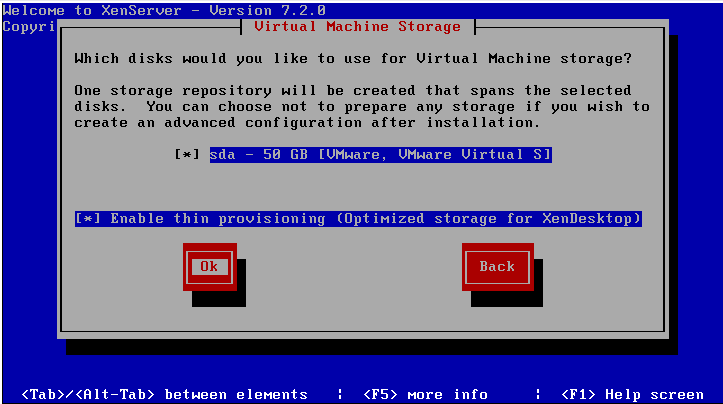

***

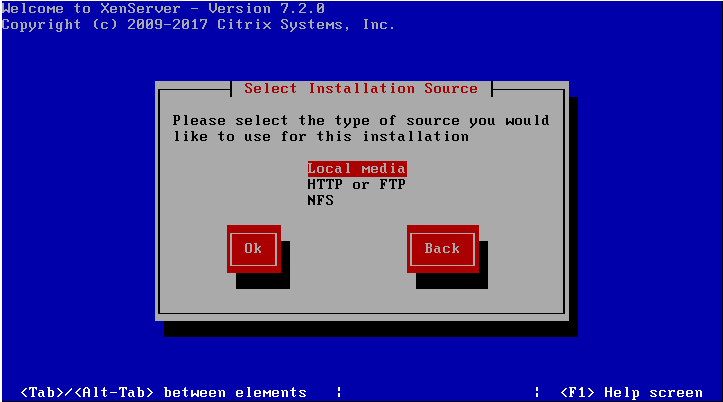

***

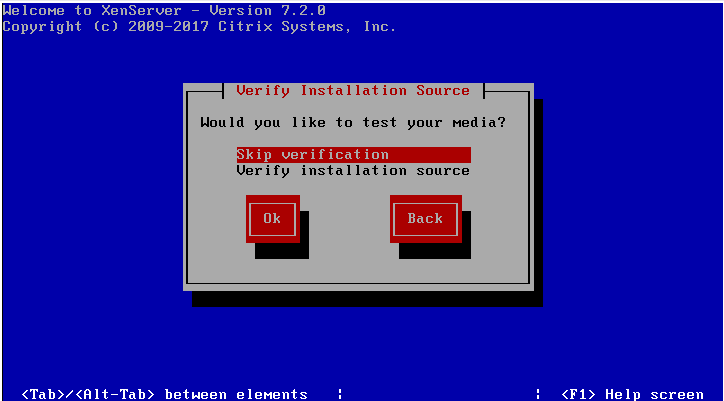

***

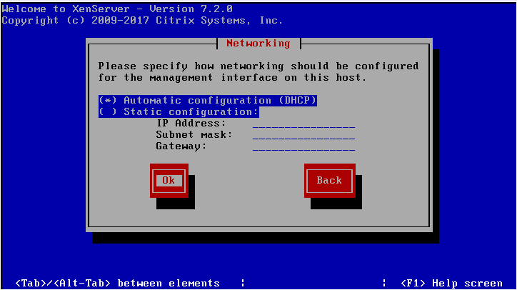

***

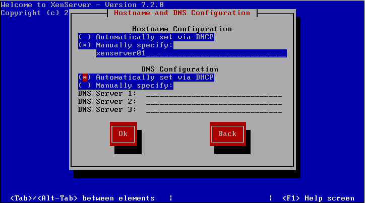

***

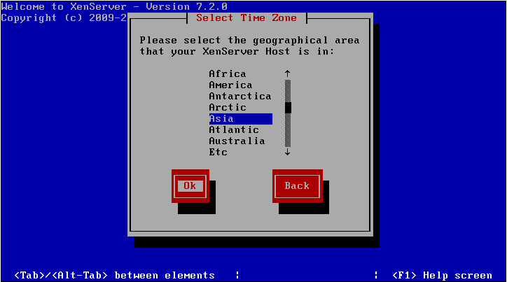

***

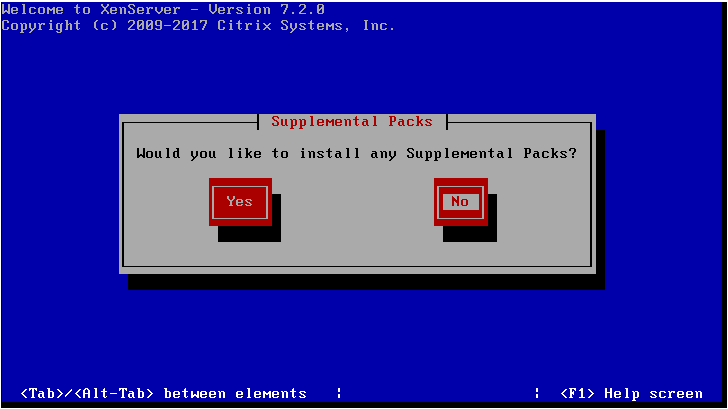

***

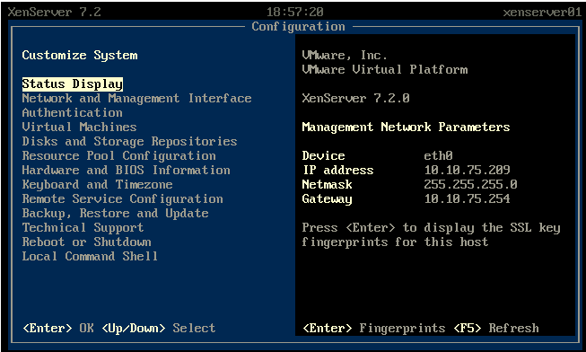

***
***

***





---

> Author: Laurance  
> URL: https://laurance.eu.org/posts/xen-%E5%AE%89%E8%A3%85xenserver/  

