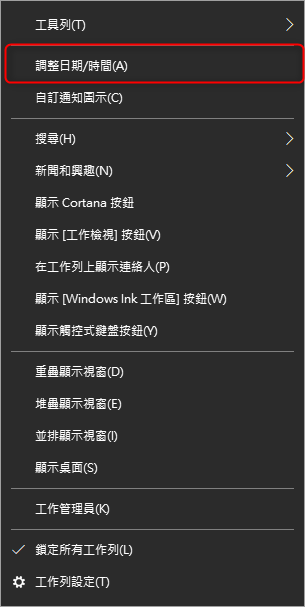
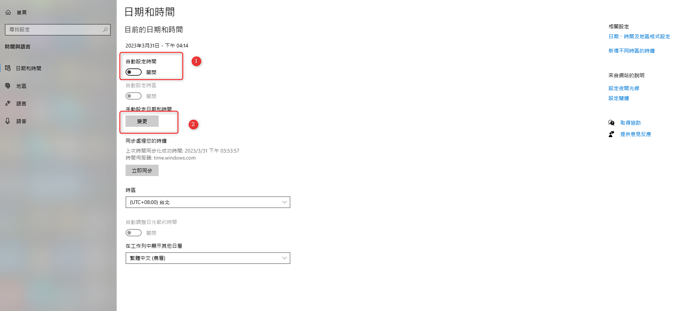
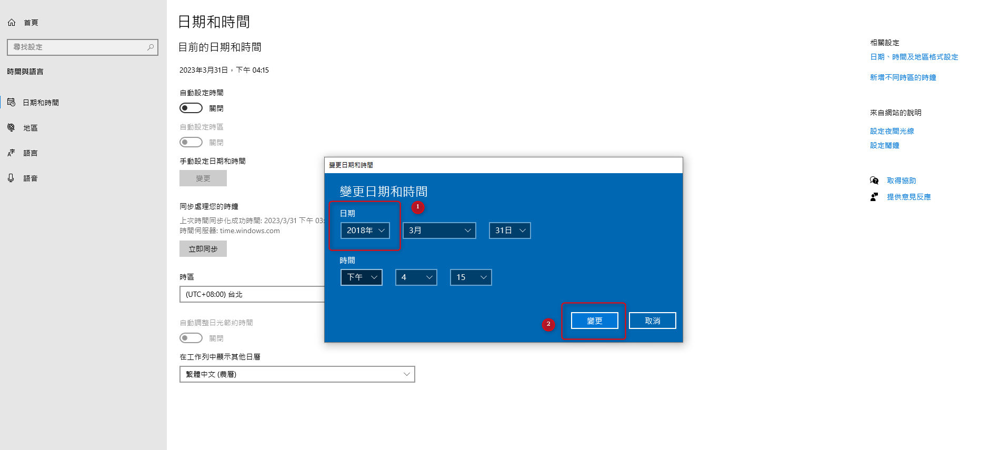
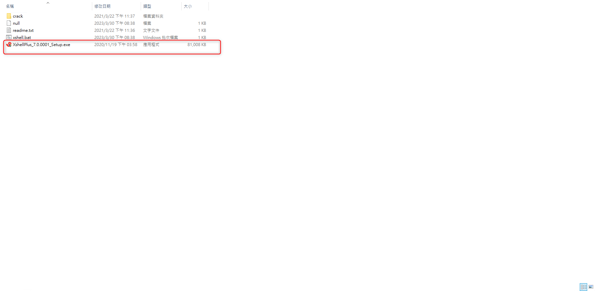
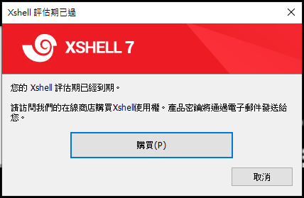
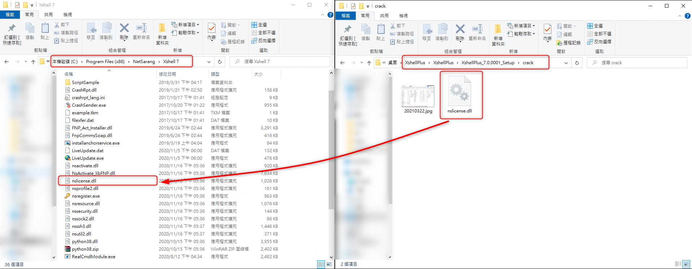
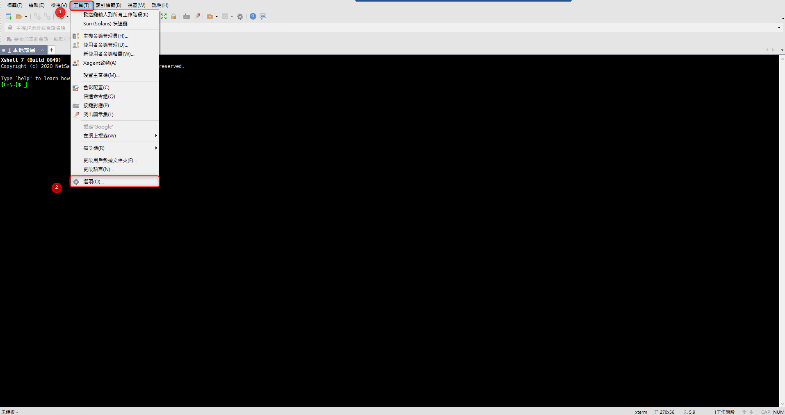
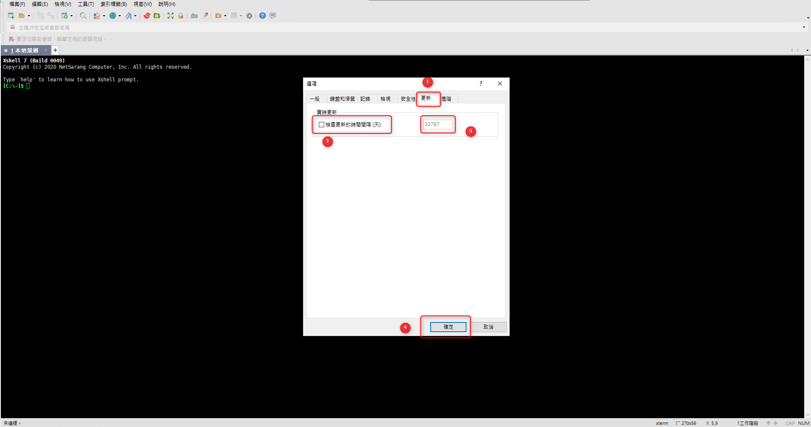
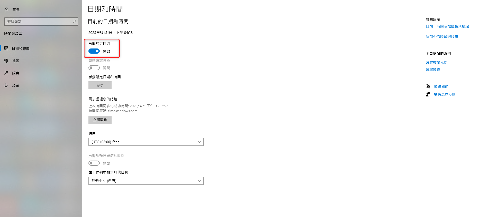
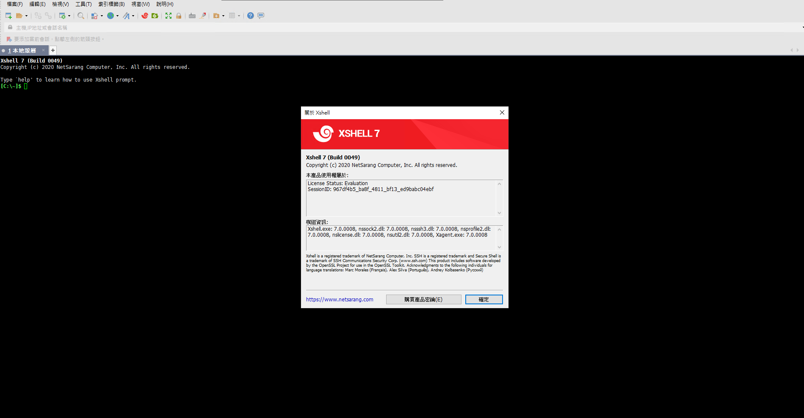

# Xshell 7 - v7.0.0001 install

***
***

**Xshell 7 - v7.0.0001 install (Cracked version)**
=====

***
***

[安裝載點](https://github.com/dingbangli/xshell7/raw/master/XshellPlus.rar)

***
***

**將桌面右下角系統時間修改為 `2018 年` 否則會跳ERROR**
-----

***
***

 

 
 
 

***
***
 
**點擊安裝檔安裝版本 `v7.0.0001`**
-----

***
***

 

***
***
 
**安裝完成後並不能直接開啟,須覆蓋一隻檔案才能開啟**
-----

***
***

 

***
***
 
**將包裡的 `nslicense.dll` 覆蓋至預設路徑 `C:\Program Files (x86)\NetSarang\Xshell 7`**
-----

***
***

 

***
***
 
**關閉自動檢查更新**
-----

`工具 > 選項 > 更新`

`將天數改為最大值並取消勾勾`

***
***

 

 

***
***

**最後將時間條回來即可**
-----

***
***

 

***
***
 
**查看金鑰已過的狀態**
-----

***
***

 

***
***

***





---

> Author: Laurance  
> URL: https://laurance.eu.org/posts/xshell-7-v7.0.0001-install/  

