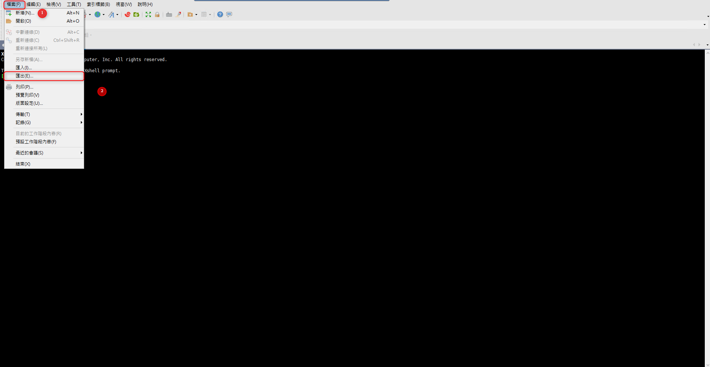
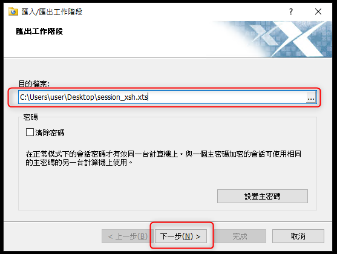
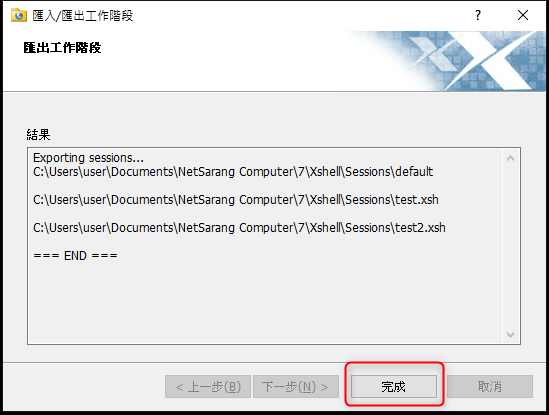
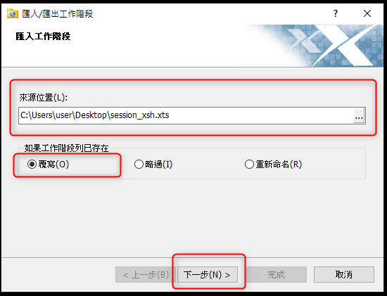
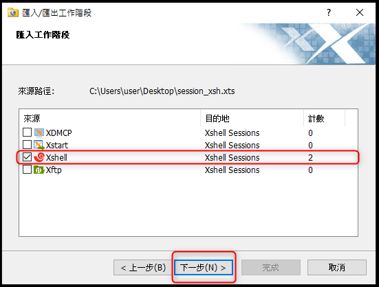

# Xshell 7 - 匯出及匯入

***
***

**Xshell 7-匯出及匯入**
=====

***
***

**將 `工作階段` 匯出成 `xxx.xts`**
-----

***
***

***
***

**開啟 `全新的 Xshell` 將 .xts 匯入**
-----

***
***

***
***

***





---

> Author: Laurance  
> URL: https://laurance.eu.org/posts/xshell-7-%E5%8C%AF%E5%87%BA%E5%8F%8A%E5%8C%AF%E5%85%A5/  

