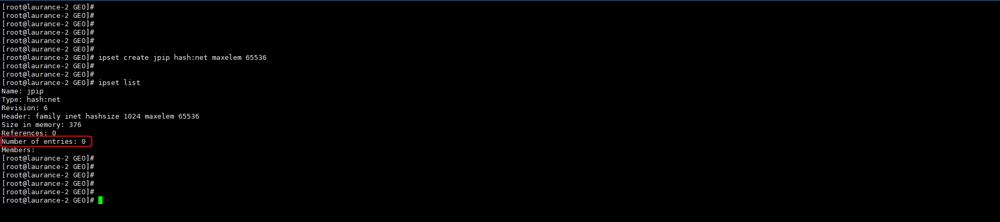
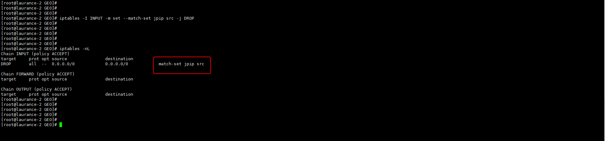

# Iptables - 如何利用 ipset 建立 iptables 集合,封鎖 國家 IP


<!--more-->
這邊記錄一下並使用 日本IP 實測

***
***

[ipblocks - 國家 IP 網站](https://www.ipdeny.com/ipblocks/)

***
***

**安裝套件 ipset**

```sql
yum -y install ipset
```

***
***
    
**下載 `日本 IP` 文件檔**
    
```sql
wget http://www.ipdeny.com/ipblocks/data/aggregated/jp-aggregated.zone
```

***
***
    
**使用 `ipset` 建立一個放 `日本IP` 的集合**
    
```sql
ipset create jpip hash:net maxelem 65536
```

***
***
    
**建立一支 shell 來抓取文件檔中的 IP**
   
```sql
vim jpip.sh
```

***
***

   

***
***
   
**查看目前集合中IP為 `0`**
   
```sql
ipset list jpip
```

***
***
    
   

***
***
    
**執行 shell 之後集合中的IP為 `2946`**
   
```sql
ipset list jpip |head -n 8
```

***
***
    
   

***
***
   
**查看 `list-jpip` 中有多少個IP ( `tail -n +9` 從第九行開始算 )**
   
```sql
ipset list jpip |tail -n +9 |wc -l
```

***
***
    
**對照文檔中的 IP數量 是否一致**
   
```sql
cat jp-aggregated.zone |wc -l
```

***
***
    
**最後使用 `iptables` 將此`集合中IP進來的封包` DROP掉**
   
```sql
iptables -I INPUT -m set --match-set jpip src -j DROP 
```

***
***

   

***
***
      
[IPSET 官網](https://www.ipdeny.com/ipblocks/)

***
***


   
### `src` 表示源地址  `dst` 表示目標地址

***
   
### `hash:net` 表示用什麼進行 hash ，也可以是 `hash:ip` 就只能 ip 不能網段 `hash:ip` `port ip+port` 進行 hash

***

### 也可以有 `timeout` 數字 這種參數，指定這個集合裏默認的超時時間單位 `s`  超時後會自動把裏面的對象刪除
   


***
***

| 常用指令 | 指令意思 |
| --- | --- |       
| ipset del yoda x.x.x.x | 從 yoda 集合中刪除內容 |     
| ipset list yoda | 查看 yoda 集合內容  |    
| ipset list | 查看所有集合的內容  |    
| ipset flush yoda | 清空 yoda 集合 |     
| ipset flush | 清空所有集合  |    
| ipset destroy yoda | 銷毀 yoda 集合 |      
| ipset destroy | 銷毀所有集合  |    
| ipset save yoda | 輸出 yoda 集合內容到標準輸出 |      
| ipset save | 輸出所有集合內容到標準輸出  |    
| ipset restore | 根據輸入內容恢復集合內容  |
    
***
***


***


<style>
.emojify {
	font-family: Apple Color Emoji, Segoe UI Emoji, NotoColorEmoji, Segoe UI Symbol, Android Emoji, EmojiSymbols;
	font-size: 2rem;
	vertical-align: middle;
}
@media screen and (max-width:650px) {
  .nowrap {
    display: block;
    margin: 25px 0;
  }
}
</style>



---

> Author: Laurance  
> URL: https://laurance.eu.org/posts/%E5%88%A9%E7%94%A8ipset%E5%BB%BA%E7%AB%8Biptables%E9%9B%86%E5%90%88-%E5%AF%A6%E7%8F%BE%E5%B0%81%E9%8E%96%E5%9C%8B%E5%AE%B6ip/  

